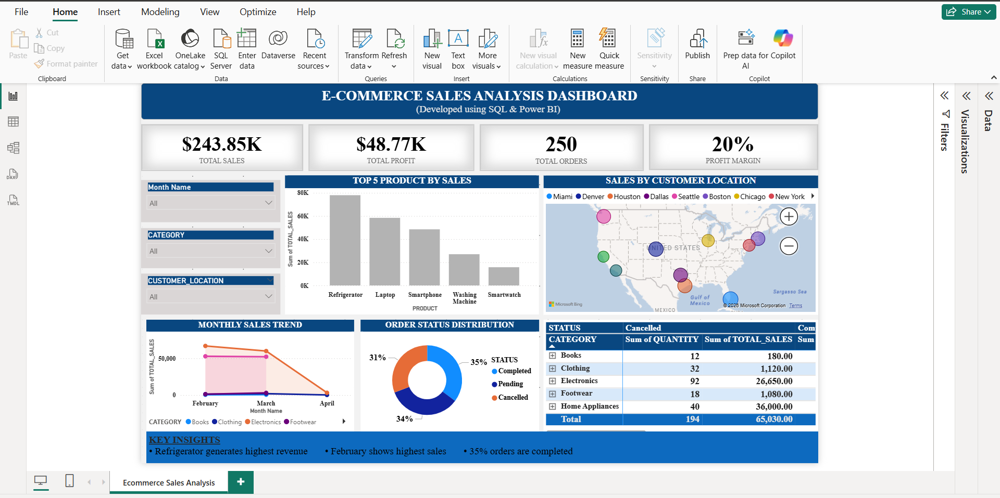

# E-Commerce Sales Analysis

## Project Overview

This project performs E-Commerce sales analysis using SQL and data visualization techniques.

The objective of this project is to extract meaningful business insights, identify sales trends, evaluate product performance, and measure key performance indicators (KPIs) to support data-driven decision-making.

---

## Tools & Technologies

- SQL (Oracle APEX) – Data cleaning, transformation, and aggregation  
- Power BI – Data modeling, DAX calculations, and dashboard visualization  

---

## Dataset Source

- Dataset downloaded from Kaggle public dataset platform.

Dataset preprocessing includes:
- Handling missing values  
- Data formatting and structuring  
- Duplicate removal  

---

## Project Workflow

### 1. Data Preparation (SQL – Oracle APEX)

- Explored raw dataset structure  
- Checked data consistency  
- Standardized date formats  
- Created structured analysis table  

Calculated Business Metrics:
- Profit = 20% of Total Sales  
- Cost = 80% of Total Sales  

## Business KPI Analysis

Aggregation functions used:
- SUM()
- COUNT()
- GROUP BY
- EXTRACT()

Key Performance Metrics:
- Total Revenue  
- Total Profit  
- Total Orders  
- Total Quantity Sold  
- Profit Margin  

Business Insights Analysis:
- Category-wise product performance  
- Regional revenue distribution  
- Top 5 products by revenue  
- Order status distribution  

### 2. Dashboard Development (Power BI)
- Created DAX measures for KPIs
- Designed interactive KPI cards
- Built monthly trend analysis
- Category-wise Sales and Quantity matrix with Order Status
- Implemented map visualization
- Added slicers for dynamic filtering

---

## Dashboard Preview

---

## Power BI File

The Power BI dashboard file (.pbix) is available in this repository.

Download the file to explore the interactive report locally using Microsoft Power BI Desktop.

---

## Project Outcome

This project demonstrates a complete end-to-end data analysis workflow — from backend SQL data processing to frontend Power BI dashboard visualization.

It highlights strong skills in SQL querying, data transformation, KPI calculation, DAX measures, and business-focused reporting.
